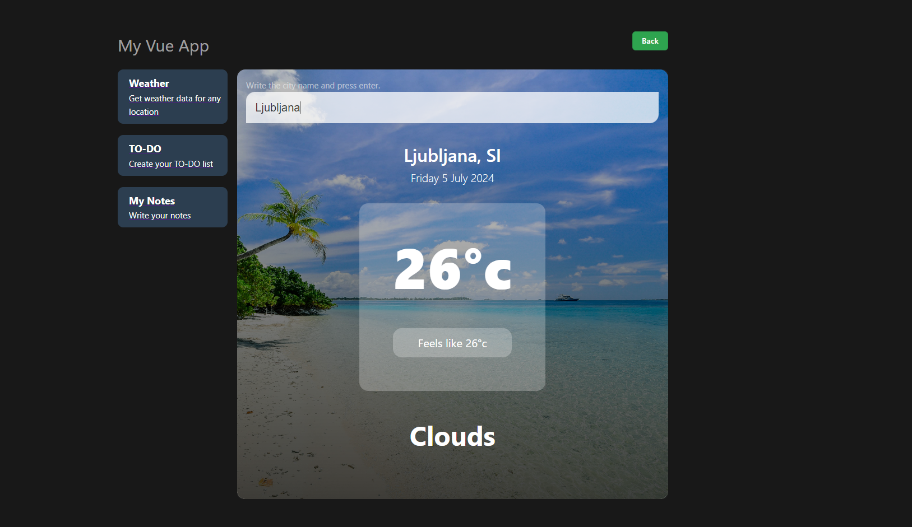
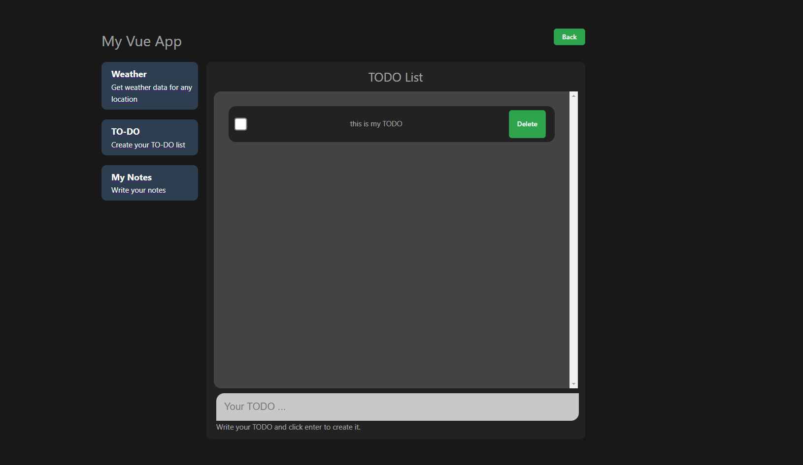
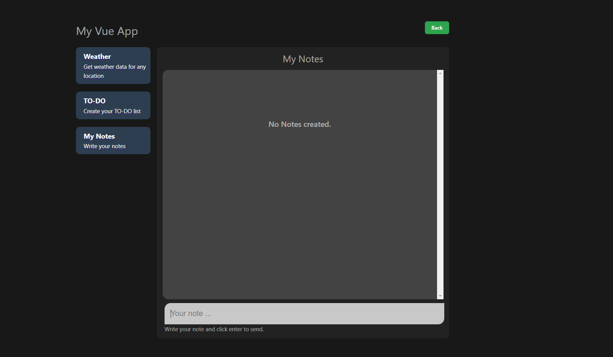

<<<<<<< HEAD
# First_VUE_APP
=======
# First Vue Project

This is my first Vue project.

Live: [https://vue.tijan.dev/](https://vue.tijan.dev/)

Built using:
- VueJs,
- Pinia,
- Vue Router,
- Vite,
- Typescript,
- CSS.

Fetures:
- get weather for any locations
- todo list
- notes page

In development:
- real time chat

Galery:

>>>>>>> b029508 (Initial commit)
